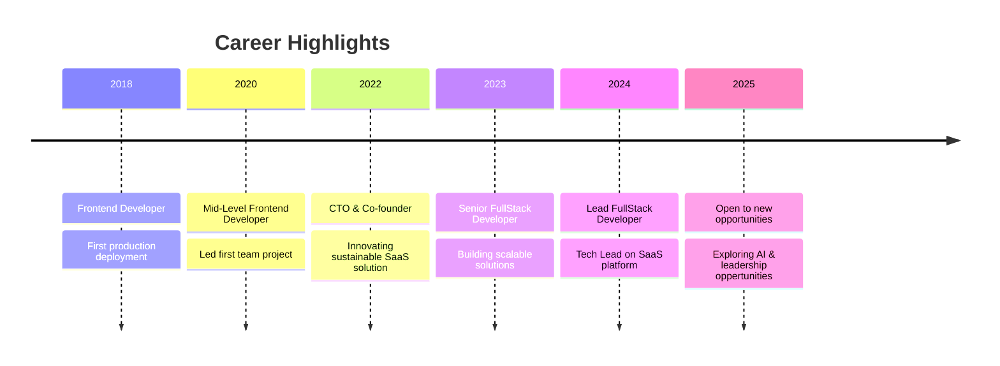

---

<!-- Animated Gradient Divider -->

##  About Me

```typescript
const hammad_imran = {
    title: "Engineering Leader & Senior Software Developer",
    location: "Berlin, Germany 🇩🇪",
    currentFocus: ["Scalable SaaS Platforms", "AI Integration", "Team Leadership"],
    passions: ["Interactive UX", "Modern Web Dev", "Developer Experience"],
    status: "Open to exciting opportunities and collaborations ✨"
};
```

<div align="center">
  
[]([[https://linkedin.com/in/maddy-9991](https://www.linkedin.com/in/hammad-imran-964824167/)](https://www.linkedin.com/in/hammad-imran-964824167/))
[](mailto:hammadimran100@gmail.com)

</div>

<!-- Animated Gradient Divider -->
## 🛠️ Tech Stack & Tools

<div align="center">

### 💻 Languages


### 🚀 Frameworks & Libraries  


### 🗄️ Databases & Cloud


### ⚙️ Tools & Platforms


</div>

<!-- Animated Gradient Divider -->
## 📊 GitHub Analytics

<div align="center">
  
</div>

<!-- <div align="center">
  
</div> -->


<!-- <div align="center">

<a href="https://github.com/maddy-9991/AI-outfit-planner">
  
</a>

<a href="https://github.com/maddy-9991/AI-meal-planner">
  
</a>

</div>

<div align="center">

### 🎨 AI Outfit Planner
**Modern TypeScript React app with live weather & AI outfit generation**


[View Live Demo](https://your-demo-link.com) • [Source Code](https://github.com/maddy-9991/AI-outfit-planner)

---

### 🍽️ AI Meal Planner  
**Full-stack meal planning with intelligent recipe suggestions**


[View Live Demo](https://your-demo-link.com) • [Source Code](https://github.com/maddy-9991/AI-meal-planner)

</div> -->

<!-- Animated Gradient Divider -->

## 💼 Professional Journey




## 🎯 Currently

- 🔭 Working on **scalable SaaS platforms** with cutting-edge technologies
- 🌱 Learning **AI integration**
- 👯 Looking to collaborate on **open-source projects** and **innovative startups**
- 💬 Ask me about **React, TypeScript, System Design, Team Leadership**
- ⚡ Fun fact: **I turn coffee into code and bugs into features** ☕


## 🤝 Let's Connect

<div align="center">

Looking for a passionate **Engineering Leader**, **Full-Stack Developer**, or **Technical Mentor**?  
Let's collaborate on something amazing! 🚀

[]([[https://linkedin.com/in/maddy-9991](https://www.linkedin.com/in/hammad-imran-964824167/)](https://www.linkedin.com/in/hammad-imran-964824167/))
[](mailto:hammadimran100@gmail.com)


<div align="center">

<a href="https://git.io/typing-svg"></a>

⭐ **If you find my projects helpful, give them a star!** ⭐

</div>

<!-- Credits: Animated template by Hammad Imran -->
